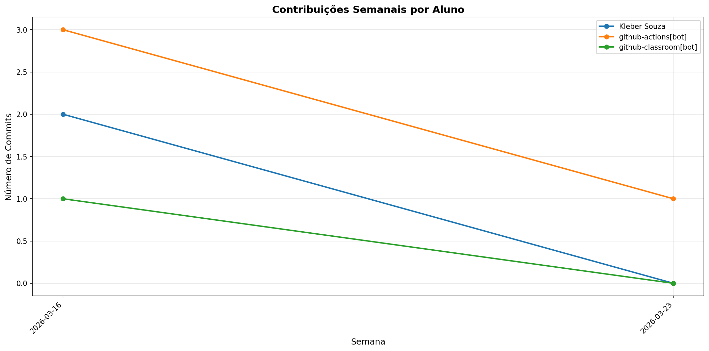

# 📊 Relatório de Contribuições do Projeto

**Última atualização:** 06/04/2026 02:08

---

## 📈 Resumo Geral de Contribuições

| Aluno                 |   Commits |   Linhas+ |   Linhas- |   Arquivos |   Docs Commits |   Docs Arquivos |
|-----------------------|-----------|-----------|-----------|------------|----------------|-----------------|
| Kleber Souza          |         2 |         2 |         2 |          2 |              2 |               1 |
| github-actions[bot]   |         4 |        53 |         8 |          3 |              4 |               1 |
| github-classroom[bot] |         1 |       774 |         0 |         19 |              1 |               3 |

## 📅 Contribuições Semanais (Todo o Semestre)

**2026-03-23**: github-actions[bot]: 1

**2026-03-16**: Kleber Souza: 2, github-actions[bot]: 3, github-classroom[bot]: 1

## 📊 Visualização Gráfica

## ℹ️ Observações

- **Commits**: Número total de commits realizados

- **Linhas+**: Linhas de código adicionadas

- **Linhas-**: Linhas de código removidas

- **Arquivos**: Número de arquivos únicos modificados

- **Docs Commits**: Commits em arquivos de documentação

- **Docs Arquivos**: Arquivos de documentação modificados

---

*Relatório gerado automaticamente via GitHub Actions*
